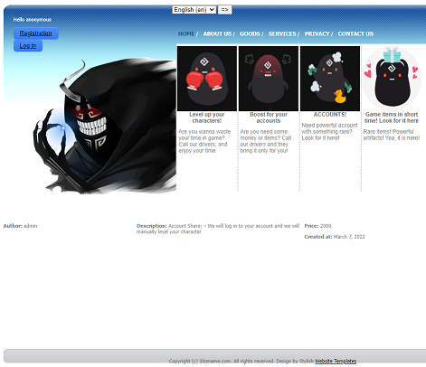

# **Web shop on django, just pet-project**

## Well we have next system of website:
____
- / - main page **WoW**
- /login/ login page **WoW AMAZING**
- /registration/ - registration page
- /about/ - page with information about us
- /privacy/ - page with privacy politics
- /goods/ - page with goods list
- /goods/X - page with detail informationabout goods, where X = integer number
- /goods_api/ - page with goods but in API vision
- /goods_api/X - page with detail information about goods, where X = integer number, but in API vision
- /services/ - page with goods list
- /services/X - page with detail information about services, where X = integer number
- /services_api/ - page with services but in API vision
- /services_api/X - page with detail information about services, where X = integer number, but in API vision
- /swagger/ - well on this page you can test HTTP requests for API system (made by drf-yasg)
- /redoc/ - documentation for API made by (drf-yasg)
____
## How install it on locale machine

- pip install -r requirements.txt or /path/to/requirements.txt (if tou change folder for requirements)
- python manage.py makemigrations (if tou delete our DB)
- pythom manage.py migrate
- python manage.py runserver

## How it looks?
____
# Main page

# Goods list

# Services list

# Goods detail

# Service detail

# About us

# Privacy
